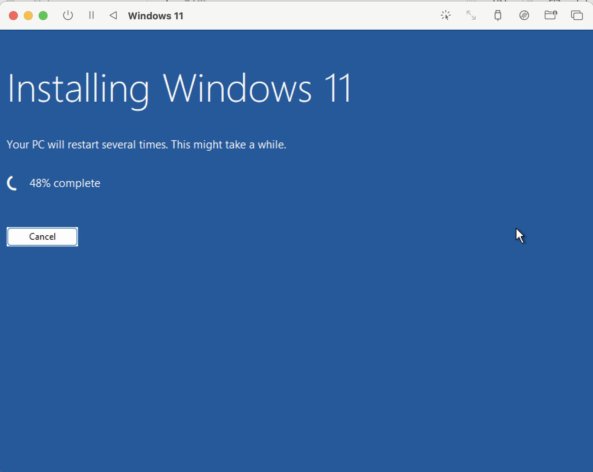
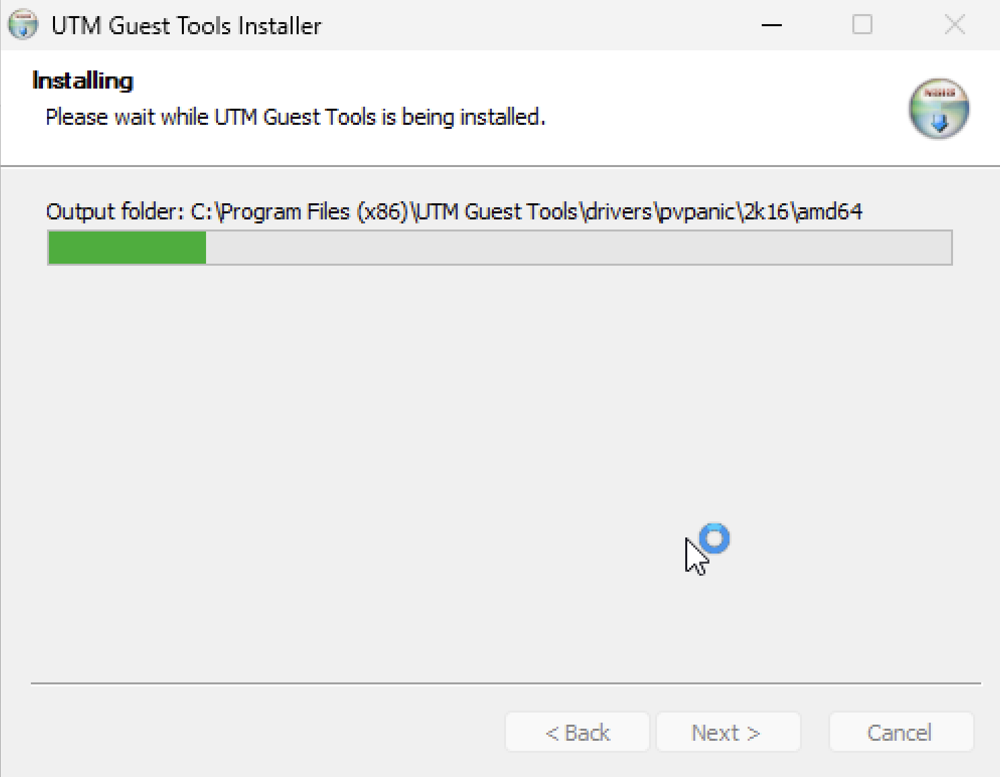
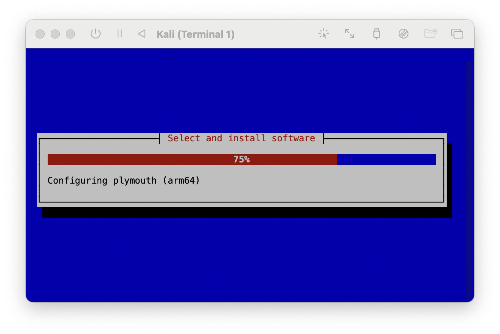
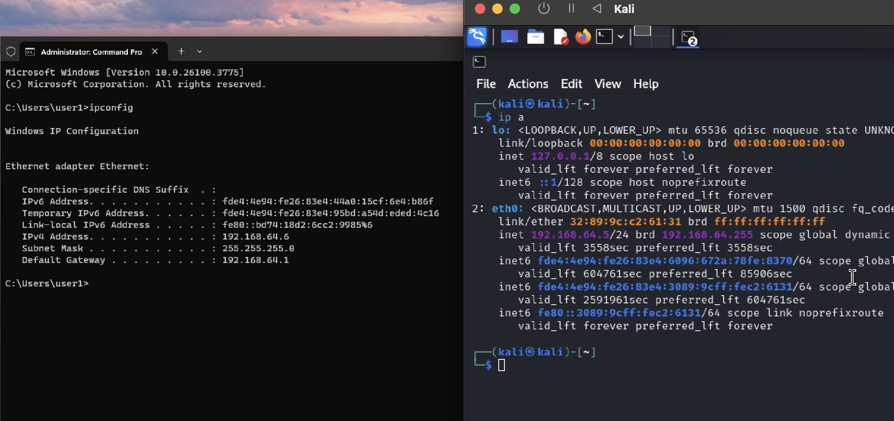

# 🛠️ Setting Up a Windows 11 and Kali Linux Cyber Lab using UTM on macOS

This guide outlines the step-by-step process of creating a virtual lab environment on macOS using UTM. The lab includes a Windows 11 VM and a Kali Linux VM, with full networking functionality for practicing cybersecurity tools and concepts.

---

## 🚀 Prerequisites

- macOS system (M1/M2/M3 or Intel-based)
- UTM virtual machine software [Download here](https://mac.getutm.app/)
- Windows 11 ISO
- Kali Linux ISO
- Internet connection

---

## 🪟 Step 1: Installing Windows 11 on UTM

1. Open UTM and click on **Create a New Virtual Machine**.
2. Choose **Virtualize** > **Windows**.
3. Follow the wizard to select the ISO, allocate CPU, RAM, and disk space.
4. Complete the setup and start the virtual machine.
5. Go through the Windows installation process.



---

## 🧰 Step 2: Installing UTM Tools for Windows 11 Compatibility

1. After Windows is installed, open the UTM VM.
2. Click **VM > Install UTM Tools** in the UTM menu bar.
3. Inside Windows, open File Explorer, go to the mounted UTM Tools drive.
4. Run the installer and reboot once installation is complete.



---

## 🐉 Step 3: Installing Kali Linux on UTM

1. Create another new virtual machine in UTM.
2. Choose **Virtualize** > **Linux**.
3. Load the Kali Linux ISO and assign resources.
4. Complete the installation steps for Kali.
```bash
sudo apt-get update && apt-get upgrade -y
```


---

## 🌐 Step 4: Displaying IP Addresses of Both VMs

### Windows:
Open **Command Prompt** and type:
```bash
ipconfig
```

### Kali:
Open **Command Prompt** and type:
```bash
ip a
```



---

---

## 📡 Step 5: Testing Connectivity Using Ping Command

Now test communication between the two virtual machines using the `ping` command.

In Terminal, run:

```bash
ping [Destination_IP]


